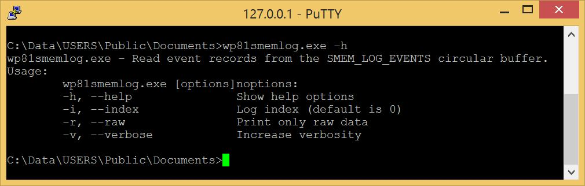
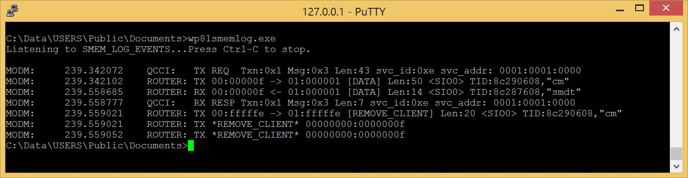

# Wp81Smemlog

Reads the log records stored in the shared memory of Windows Phone 8.1  
This shared memory is managed by the [qcsmem8930.sys](https://github.com/fredericGette/Lumia520/blob/main/content/drivers/qcsmem8930.md) driver.  

## Usage



By default the log index is 0 which correspond to the logs of the modem subsystem (SMEM_LOG_EVENTS).  



Log index 1 corresponds to the SMEM_LOG_POWER_EVENTS, but this part of the shared memory is always empty in my case.

Only a small subset of the logs are parsed by `Wp81Smemlog.exe`  
But the option `-r` displays the raw content of the records. And the result can be parsed by the Qualcomm script [smem_log.pl](https://github.com/ele7enxxh/msm8909w-law-2-0_amss_standard_oem/blob/1710/modem_proc/core/mproc/smem/tools/smem_log.pl).  

## Deployment

- [Install a telnet server on the phone](https://github.com/fredericGette/wp81documentation/tree/main/telnetOverUsb#readme), in order to run the application.  
- Manually copy the executable from the root of this GitHub repository to the shared folder of the phone.
> [!NOTE]
> When you connect your phone with a USB cable, this folder is visible in the Explorer of your computer. And in the phone, this folder is mounted in `C:\Data\USERS\Public\Documents`  

### Installation of the kernel drivers "wp81controlsmemdevice.sys"

This driver allows communication between `Wp81Smemlog.exe` and `qcsmem8930.sys` driver.

- Manually copy the .sys from the driver folder of this GitHub repository to the shared folder of the phone.
- Install the driver:
```
sc create wp81controlsmemdevice type= kernel binPath= C:\Data\USERS\Public\Documents\wp81controlsmemdevice.sys
```
- Start the driver:
```
sc start wp81controlsmemdevice
```

> [!NOTE]
> You have to start this control driver after every reboot of the phone.  
  
